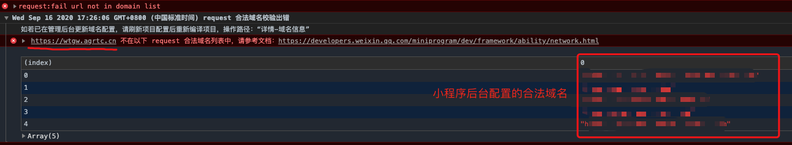
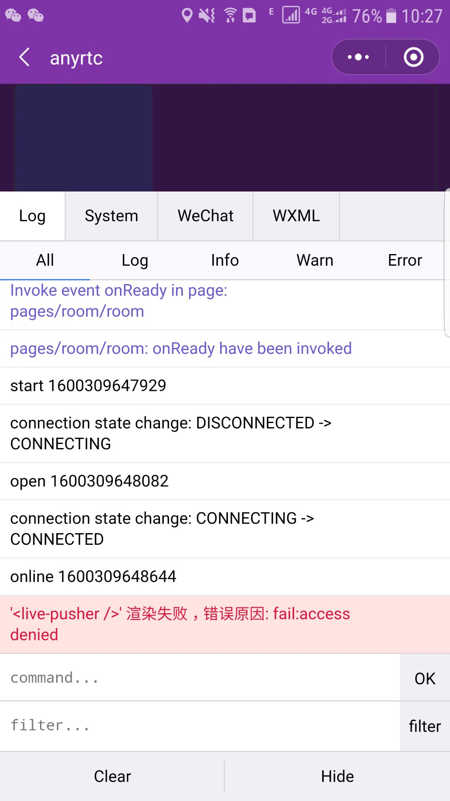

## 小程序常见问题及解决办法？

### 1. request/websocket 合法域名校验出错?

项目上线或项目设置中没有勾选「不校验合法域名、web-view（业务域名）、TLS版本以及 HTTPS 证书」的情况下，微信会对小程序请求的url进行校验，如果不在合法域名的列表中将会对其请求进行拦截。如下图：



#### 解决办法：
- 前往[小程序管理后台](https://mp.weixin.qq.com/) ，找到「开发」 - 「开发设置」 - 「服务器域名」，点击修改
- 设置下方合法域名
  ```
  // request合法域名
  https://wtgw.agrtc.cn

  // socket合法域名
  wss://wtnode.agrtc.cn
  ```
- 提交并保存

> 注意事项请参考[这里](https://developers.weixin.qq.com/miniprogram/dev/framework/ability/network.html)。

### 2. 为什么live-player / live-pusher 组件无法被其他组件覆盖？

`live-player`、 `live-pusher` 组件为微信内置的原生组件，在微信小程序中原生组件的层级是最高的，所以页面中的其他组件无论设置 `z-index` 为多少，都无法盖在原生组件上。


#### 解决办法：

为了解决原生组件层级最高的限制。小程序专门提供了 [`cover-view`](https://developers.weixin.qq.com/miniprogram/dev/component/cover-view.html) 和 [`cover-image`](https://developers.weixin.qq.com/miniprogram/dev/component/cover-image.html) 组件，可以覆盖在部分

原生组件上面。更多详情请浏览  [微信开放文档](https://developers.weixin.qq.com/miniprogram/dev/component/native-component.html) ;


### 3. live-player / live-pusher <font color="#FF0000">渲染失败 , 错误原因：fail：access denied </font> 

`live-player` / `live-pusher` 组件都需要用户授权 `scope.camera`、`scope.record`。同时还需要申请微信的组件权限，如果未获得该权限则会在使用live-player / live-pusher 组件拉流时报 <font color="#FF0000">渲染失败 , 错误原因：fail：access denied </font> 的错误，如下图：



#### 解决办法：

- 需要先通过类目审核
- 在小程序管理后台，「开发」-「接口设置」中自助开通该组件权限。

具体详情请参考「[微信官方文档](https://developers.weixin.qq.com/miniprogram/dev/component/live-pusher.html)」。


### 4. live-pusher 组件上如何切换摄像头？

修改 live-pusher 组件上的 device-position 属性是无法切换摄像头的。

#### 解决办法：

调用 wx.createLivePusherContext() 创建的 live-pusher上下文 [LivePusherContext](https://developers.weixin.qq.com/miniprogram/dev/api/media/live/LivePusherContext.html) 对象上面的 switchCamera 方法 ；

#### 示例代码：

```
<!-- wxml -->
<live-pusher id="livePuser" url="https://domain/push_stream" mode="RTC" autopush bindstatechange="statechange" style="width: 300px; height: 225px;" />


<!-- js -->
wx.createLivePusherContext("#livePuser").switchCamera({
  complete: function() {
    
  }
})
```


### 5. live-player 延时大？

使用 `live-player` 拉流时远端人员的音视频延时比较大

#### 解决办法：

检查 `live-player` 组件是否设置 `mode`属性，如果不设置微信会默认设置为`live`，这里我们只需要设置为`rtc`模式即可。


### 6. live-player 黑屏？

为什么 live-player 黑屏？原因有很多，根据下方提示进行排查。

#### 解决办法：

- 拉流地址是否正确
- 检查 `live-player` 组件的 `src` 属性是否存在，往往很多同学喜欢写成 `url` 属性
- 检下行带宽查是否不足