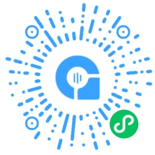

## 简介

ArRTC SDK for Wechat 是为了与anyRTC音视频云平台多端互通，而单独设计的一个全新SDK，SDK可实现如下功能：

- 音视频通话
- 音视频直播


适用于如下场景：

- 线上课堂：1 对 1 及 1 对多线上小班课，老师、学生实时互动
- 在线医疗：突破医疗资源的地域限制，实现多方视频会诊，降低诊断成本
- 高端客服：对高价值的 VIP 客户提供远程视频服务，1 对 1 实时交流
- 远程报警：一键报警，通过实时视频通信，为警方提供一手现场情况
- 银行开户：实时视频认证，清晰画质、超低延时、隐私保护，提升开户效率


## Demo 体验



GitHub [源码地址](https://github.com/anyRTC/ArMiniappSDK)

## 核心类及方法


ArRTC 的 Client 类提供了 anyRTC Miniapp SDK 核心功能，首先我们需要创建一个 Client 实例 `ArRTC.client`

```
let client = new ArRTC.client();
```

`ArRTC.client`实例包含以下API：

- [init](../api/client#init)：初始化对象
- [setRole](../api/client#setRole)：设置用户角色
- [join](../api/client#join)：加入频道
- [publish](../api/client#publish)：发布音视频流
- [unpublish](../api/client#unpublish)：停止发布音视频流
- [subscribe](../api/client#subscribe)：订阅远端音视频流
- [unsubscribe](../api/client#unsubscribe)：停止订阅远端音视频流
- [muteLocal](../api/client#muteLocal)：停止发送本地音视频流
- [unmuteLocal](../api/client#unmuteLocal)：恢复发送本地音视频流
- [mute](../api/client#mute)：停止接收远端音视频流
- [unmute](../api/client#unmute)：继续接收远端音视频流
- [off](../api/client#off)：取消监听事件
- [rejoin](../api/client#rejoin)：重新加入频道
- [leave](../api/client#leave)：退出频道
- [destroy](../api/client#destroy)：销毁客户端对象


