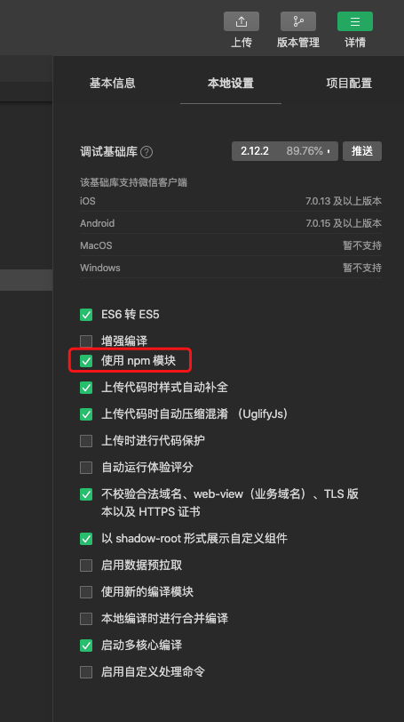

本文指导你如何准备开发环境并将 ArRTC SDK for WeChat 集成到你的项目中。

## 前提条件
在使用 anyrtc Web SDK 之前，你需要:
- [注册](https://console.anyrtc.io/signup) 一个有效的 anyrtc 账号。

- 在[控制台](https://console.anyrtc.io/)创建一个项目，鉴权机制选择 **APP ID**。

- [微信开发者工具](https://developers.weixin.qq.com/miniprogram/dev/devtools/download.html)

- 项目配置合法域名

  前往[小程序管理后台](https://mp.weixin.qq.com/) ，找到「开发」 - 「开发设置」 - 「服务器域名」，点击修改，按照下方的域名进行设置并提交保存，注意事项请参考[这里](https://developers.weixin.qq.com/miniprogram/dev/framework/ability/network.html)。
  ```
  // request合法域名
  https://wtgw.agrtc.cn

  // socket合法域名
  wss://wtnode.agrtc.cn
  ```

  *注意：* 

  - 上线必须设置，否则请求会被微信拦截；
  - 项目测试阶段可以在「项目设置」中勾选 `不校验合法域名、web-view（业务域名）、TLS版本以及 HTTPS 证书`

:::caution 如果你的网络环境部署了防火墙，请根据[应用企业防火墙限制](https://docs.anyrtc.io/platforms/docs/firewall)打开相关端口。
:::

> 项目测试阶段，我们默认使用 `APP ID` 完成鉴权，也就是只需在 SDK 设置好 `APP ID` 即可完成鉴权。如果你打算将项目上线，请在之后的开发过程中将鉴权机制更换为安全性更高的 **APP ID + APP 证书 + Token**。鉴权机制，详见[检验用户权限](https://docs.anyrtc.io/platforms/docs/token)文档。


## 小程序开发流程

### 开通小程序服务

第一次使用微信小程序需要先开通服务，步骤如下：

1. 登录 [控制台](https://console.anyrtc.io/)，点击左侧导航栏的**项目管理** 图标 进入「项目管理页面」。
2. 选择创建的「小程序应用」上的「操作」按钮，在页面「功能」里面找到「开通小程序」。


### 配置微信小程序推拉流组件

在微信小程序中实现音视频功能，需要使用微信的 [live-player](https://developers.weixin.qq.com/miniprogram/dev/component/live-player.html) 组件和 [live-pusher](https://developers.weixin.qq.com/miniprogram/dev/component/live-pusher.html) 组件。

:::note 在集成微信小程序组件之前，建议你先阅读[微信小程序开发官网文档](https://developers.weixin.qq.com/miniprogram/dev/framework/)
:::

- live-player 组件

  该组件用于实现微信小程序的实时音视频播放功能。开发者在创建该组件后，还需要在 js 文件中调用 API 接口对应的组件来实现该功能。创建 live-player 的示例代码如下：

  ```javascript
    <live-player
      id="player"
      src="{{rtmp 播放地址}}"
      mode="RTC"
      bindstatechange="playerStateChange"
      object-fit="fillCrop" />
  ```

  

- live-pusher 组件

  该组件用于实现微信小程序的实时音视频录制功能。开发者在创建该组件后，还需要在 js 文件中调用 API 接口对应的组件来实现该功能。创建 live-pusher 的示例代码如下：

  ```javascript
    <live-pusher
      url="{{rtmp 推流地址}}"
      mode="RTC"
      bindstatechange="recorderStateChange" />
  ```
  
  :::caution 注意：
  
  - `live-pusher`组件的推流地址使用的 `url` 属性，而 `live-player`组件的拉流地址使用的是 `src` 属性。
  - 推流组件和拉流组件都需要在 [小程序管理后台](https://mp.weixin.qq.com/) 的「开发」-「接口设置」中自助开通该组件权限。
  
  :::


### 集成微信小程序SDK

- #### 本地引入
  - 下载 [ArRTC Miniapp SDK]()

  - 导入SDK

    ```
    import ArRTC from "路径/ArRTCMiniapp@late";
    ```

    

- #### npm 

  - 使用npm模块
  
    打开「设置」 - 「项目设置」 - 「本地设置」中 **☑️** 使用npm模块。
    

  - 终端进入项目的根目录，并安装 `ar-rtc-miniapp`

    ```
    //进入项目目录
    cd 项目/
    
    //安装SDK
    npm i ar-rtc-miniapp -S
    ```

    :::note 构建npm

    执行完这一步，需要点击「微信小程序」-「工具」-「构建npm」，如果是 typescript 项目，需要在根目录执行 `npm run tsc`

    :::
  

  - 导入SDK

    ```
    import ArRTC from "ar-rtc-miniapp";
    ```

现在，我们已经将 anyrtc Web SDK 集成到项目中了。SDK 会在全局导出一个 `ArRTC` 对象，直接访问这个对象即可操作 SDK。下一步我们要通过调用 anyrtc Web SDK 提供的核心 API 实现基础的音视频通话功能。